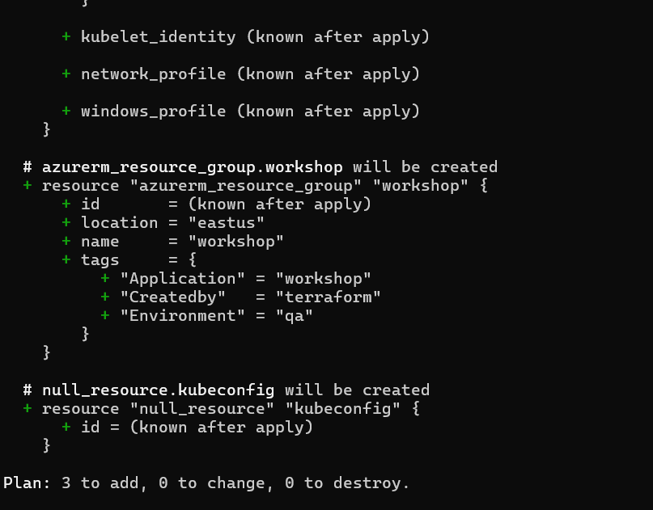
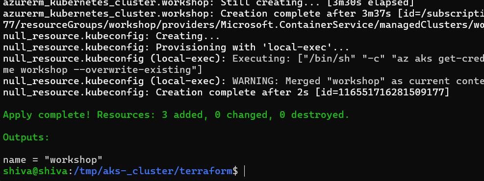
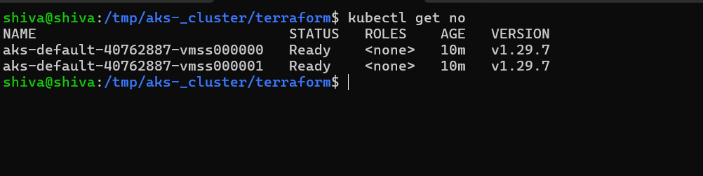
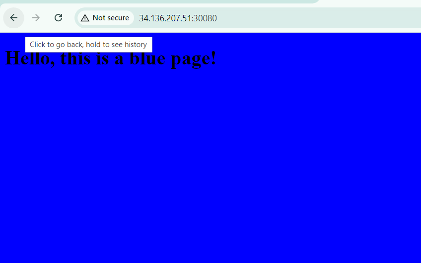
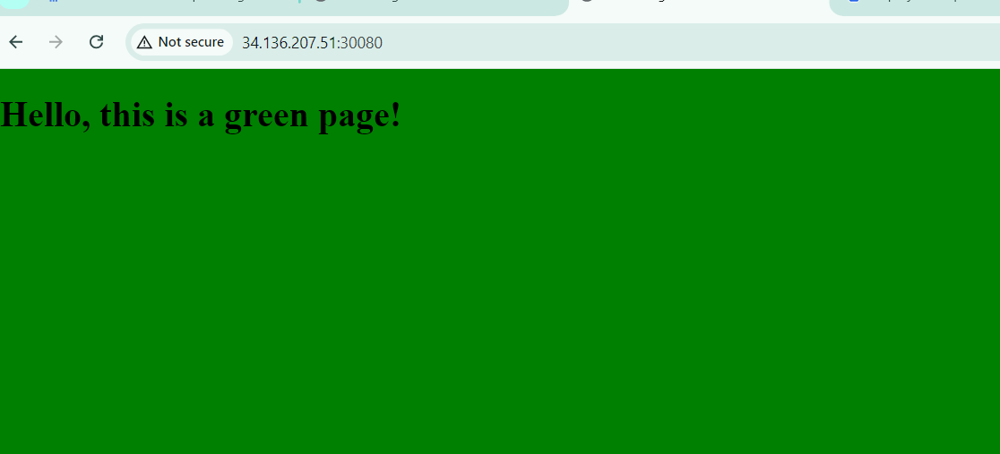

# task-1
* create azure vm
* dependecies install 
* azure cli install in vms 

```
    curl -sL https://aka.ms/InstallAzureCLIDeb | sudo bash
```

* install docker on vm
```sh
    curl -fsSL https://get.docker.com -o get-docker.sh
    sh get-docker.sh
    sudo usermod -aG docker <username>
```
docker image pull longflew/ingress:BLUEPAGE
docker image pull longflew/ingress:GREENPAGE

docker tag longflew/ingress:BLUEPAGE <repo_name:image>

docker tag longflew/ingress:GREENPAGE <repo_name:image>

docker push shiva.azurecr.io/longflew/ingress:BLUEPAGE
docker push shiva.azurecr.io/longflew/ingress:GREENPAGE


* create image pull secretes 
```
kubectl create secret docker-registry <secret-name> \
    --namespace <namespace> \
    --docker-server=<container-registry-name>.azurecr.io \
    --docker-username=<service-principal-ID> \
    --docker-password=<service-principal-password>
```

## create AKS cluster 

* createing aks using by terraform 
* [ReferHere](https://github.com/dhille98/aks-_cluster.git) 
* after creating resource 

* deploying the terraform frist manuvally 
useing this commands 

```sh
    terrafrom init
    terraform validate
    terraform fmt
    terraform plan
    terraform apply 
```


* after every thing is ok delete `terraform destory`


# by create AKS cliuster in manvaly 

```sh
    az group create --name workshop --location eastus

    az aks create --resource-group workshop --name my-cluster --node-count 2 --node-vm-size  Standard_B2ps_v2 --generate-ssh-keys


    az aks get-credentials --resource-group workshop --name my-cluster
```


# deployment in kubenetes 

🔮 Rolling Deployment: Incrementally replaces instances of the previous version of an application with the new version without downtime.

🔮 Blue-Green Deployment: Involves two identical environments, one hosting the current version (blue) and the other hosting the new version (green). Traffic is switched from blue to green once the new version is ready.
🔮 Canary Deployment: Releases the new version to a small subset of users before rolling it out to the entire user base. This strategy allows for testing in production with real users and workloads.

🔮 A/B Testing: Similar to canary deployments but specifically targets testing new features or changes among different user segments to compare performance.

🔮 Feature Toggles (Feature Flags): Allows teams to enable or disable features in the application without deploying new code. This facilitates testing and gradual rollout of new features.


### we create deployment 
```yaml
---
apiVersion: apps/v1
kind: Deployment
metadata:
  name: app-blue
  labels:
    app: my-app
    environment: blue
spec:
  replicas: 2
  selector:
    matchLabels:
      app: my-app
      environment: blue
  template:
    metadata:
      labels:
        app: my-app
        environment: blue
    spec:
      containers:
      - name: my-app
        image: longflew/ingress:BLUEPAGE
        ports:
        - containerPort: 80
      imagePullSecrets:
        - name: shiva-docker-images
        resources:
          requests:
            cpu: 100m
            memory: 128Mi
          limits:
            cpu: 200m
            memory: 256Mi
```
* service file 

```yaml
---
apiVersion: v1
kind: Service
metadata:
  name: my-service
  
spec:
  type: NodePort
  selector:
    app: my-app
    version: blue
  ports:
  - protocol: TCP
    port: 80
    targetPort: 80 # Port on the Node.js container
    nodePort: 30080
```

```sh
    kubectl apply -f blue-app.yml

    kubectl apply -f service.yml
```
we check that application is correctly deployed or not 

```sh
kubectl get po 
kubectl get svc <svc-name>
kubectl describe endpoints 
kubectl describe svc <svc-name>
```

* create new image in deployment file like 
```yaml
# green-deployment.yaml
apiVersion: apps/v1
kind: Deployment
metadata:
  name: my-app-green
spec:
  replicas: 3
  selector:
    matchLabels:
      app: my-app
      version: green
  template:
    metadata:
      labels:
        app: my-app
        version: green
    spec:
      containers:
      - name: my-app
        image: longflew/ingress:GREENPAGE
        ports:
        - containerPort: 80
        resources:
          requests:
            cpu: 100m
            memory: 128Mi
          limits:
            cpu: 200m
            memory: 256Mi
```
after that deploy the application in `kubectl apply -f green-deployment.yaml`

* every thing ok edit the service file 

```
    kubectl edit svc <service.ymal> 
    # change the sceltors in service file 
    # yaml file
        targetPort: 80
  selector:
    app: my-app
    version: green # change the version (blue/green) 
  sessionAffinity: None

```




### setup on azure devops cicd 


* next step 

* step azure pipeline 
* first create repo in the azure organations in project 
* we deploy the azure-devops pipline 
* writing a azure pipeline
```yaml
# Docker
# Build a Docker image
# https://docs.microsoft.com/azure/devops/pipelines/languages/docker

trigger:
  - dev


stages:
  
  - stage: DeployBlueGreen
    displayName: 'Blue-Green Deployment'
    jobs:
      - job: deploy
           displayName: 'Deployment'
           pool: Default
           steps:
             - bash: 'terraform init && terraform apply -auto-approve'
               displayName: 'Create k8s cluster'
               workingDirectory: 'terraform/'
             - bash: 'kubectl apply -f deployment/'
               displayName: 'Deploy application'
```
